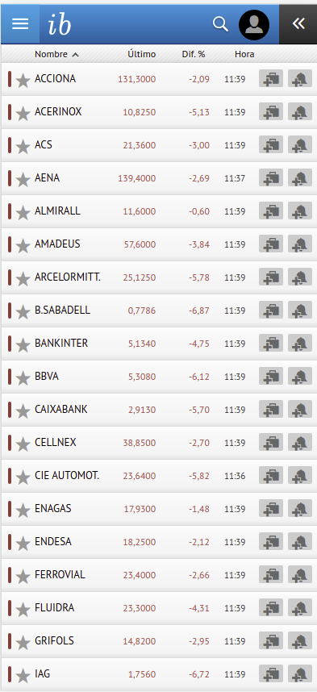
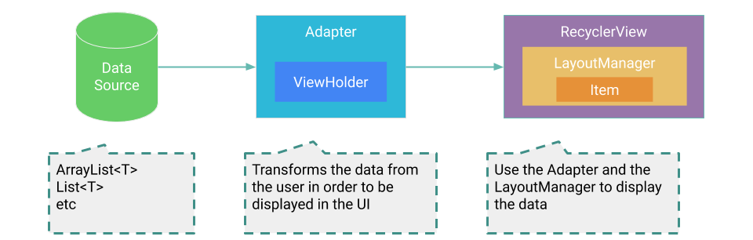
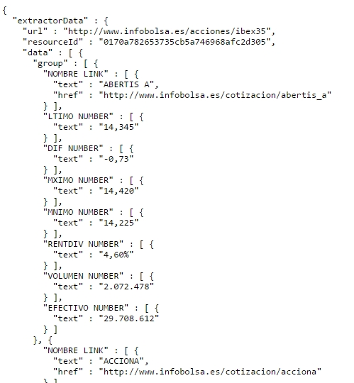

# Aplicaciones para Dispositivos Móviles

## Práctica 1: Crear una lista que muestre nuestros datos (RecyclerView)

### Caso práctico similar: IBEX35

Pongamos que queremos obtener algo como esto:



Se trata de una lista deslizable de elementos y cada elemento está formado por una vista cuyo patrón de diseño se va repitiendo.

En esta práctica utilizaremos la *RecyclerView*, que es una vista más avanzada que *ListView* o *GridView* ya que es más eficiente y flexible:

* Se llama **RecyclerView** porque realiza un recliclado de vistas mediante el patrón **ViewHolder** que deberéis utilizar.
* Mediante el **LayoutManager** podéis especificar si queréis un vista de lista o de cuadrícula, por ejemplo.
* Incorpora animaciones automáticas para por ejemplo insertaro borrar elementos (**ItemAnimator**).
* Podéis personalizar por ejemplo los separadores (**ItemDecorator**).



* La fuente de datos (*data source*) es de donde nosotros vamos a extraer los datos, ya sea una base de datos, una petición HTTP o un fichero local.
* El *Adapter* conecta los datos con la *RecyclerView*.
* El *View holder* proporciona la referencia al tipo de vista que se va a usar.
* En un *Layout* definiremos cómo mostrar uno de nuestros elementos.
* El *Layout manager* se encarga de disponer los elementos en una vista (Linear, Grid, Stagered...)

Pasos a realizar para hacer nuestra aplicación del Ibex35:

1. Diseñar un Layout que contenga nuestro RecyclerView.
2. Diseñar un Layout individual para los elementos a mostrar.
3. Implementar una actividad que visualice el RecyclerView.
4. Definir el LayoutManager que posicione las vistas.
5. Crear un Adapter para personalizar cada elemento.

**1. Diseñar un Layout que contenga nuestro RecyclerView**

Creamos una actividad vacía:

```
public class IbexActivity extends AppCompatActivity {

    @Override
    protected void onCreate(Bundle savedInstanceState) {
        super.onCreate(savedInstanceState);
        setContentView(R.layout.activity_ibex);
    }
}
```
Editamos activity_ibex.xml para que incluya un RecyclerView:

```
<?xml version="1.0" encoding="utf-8"?>
<androidx.constraintlayout.widget.ConstraintLayout xmlns:android="http://schemas.android.com/apk/res/android"
    xmlns:app="http://schemas.android.com/apk/res-auto"
    xmlns:tools="http://schemas.android.com/tools"
    android:layout_width="match_parent"
    android:layout_height="match_parent"
    tools:context=".IbexActivity">
    
<androidx.recyclerview.widget.RecyclerView
    android:layout_width="match_parent"
    android:layout_height="match_parent"
    android:id="@+id/recyclerview"
    android:scrollbars="vertical" />
    
</androidx.constraintlayout.widget.ConstraintLayout>
```

**2. Diseñar un Layout individual para los elementos a mostrar**

Creamos un nuevo layout para el elemento: elemento.xml
```
<?xml version="1.0" encoding="utf-8"?>
<RelativeLayout xmlns:android="http://schemas.android.com/apk/res/android"
    xmlns:app="http://schemas.android.com/apk/res-auto"
    xmlns:tools="http://schemas.android.com/tools"
    android:layout_width="wrap_content"
    android:layout_height="wrap_content"
    android:paddingLeft="10dp"
    android:paddingRight="10dp">

    <TextView
        android:id="@+id/nombre"
        android:layout_width="wrap_content"
        android:layout_height="wrap_content"
        android:layout_alignParentLeft="true"/>

    <TextView
        android:id="@+id/valor"
        android:layout_width="wrap_content"
        android:layout_height="wrap_content"
        android:layout_alignParentRight="true"
        android:layout_toEndOf="@+id/nombre"
        android:layout_toRightOf="@+id/nombre"
        
    <TextView
        android:id="@+id/diff"
        android:layout_width="wrap_content"
        android:layout_height="wrap_content"
        android:layout_alignParentRight="true"
        android:layout_toEndOf="@+id/valor"
        android:layout_toRightOf="@+id/valor"/>

</RelativeLayout>
```

**3. Implementar una actividad que visualice el RecyclerView**
**4. Definir el LayoutManager que posicione las vistas**

Volvemos a la actividad creada IbexActivity e implementamos algunos detalles:

```
public class IbexActivity extends AppCompatActivity {
    private RecyclerView recyclerView;
    private RecyclerView.LayoutManager layoutManager;
    
    @Override
    protected void onCreate(Bundle savedInstanceState) {
        super.onCreate(savedInstanceState);
        setContentView(R.layout.activity_ibex);
        
        //Set up the RecyclerView
        recyclerView = (RecyclerView) findViewById(R.id.recyclerview);
        recyclerView.setAdapter(new ElementAdapter(this));
        recyclerView.setHasFixedSize(true);
        layoutManager = new LinearLayoutManager(this); //Also GridLayoutManager...
        recyclerView.setLayoutManager(layoutManager);
    }
}
```

**5. Crear un Adapter para personalizar cada elemento**
```
public class ElementAdapter extends RecyclerView.Adapter<ElementAdapter.ViewHolder> {
    
    private ArrayList<IbexElement> elementos; //IbexElement is a class that contains some attributes like nombre, valor, diff...
    Context context;
    
    public ElementAdapter(Context c) {
        context=c;
        Init();
    }

    public void Init() {
        // We read the JSON file and fill the “elementos” ArrayList 
        // For you to figure it out.
    }
    
    @Override
    public int getItemCount() {
        return elementos.size();
    }
    
    /**
     * Provide a reference to the type of views that you are using
     * (custom ViewHolder).
     */
    public static class ViewHolder extends RecyclerView.ViewHolder {
        private final TextView nombre;
        private final TextView valor;
        private final TextView diff;

        public ViewHolder(View view) {
            super(view);
            nombre = (TextView) view.findViewById(R.id.nombre); //reference the views we defined in the layout
            valor = (TextView) view.findViewById(R.id.valor);
            diff = (TextView) view.findViewById(R.id.diff);
        }
    }

    // Create new views (invoked by the layout manager)
    @NonNull
    @Override
    public ViewHolder onCreateViewHolder(ViewGroup viewGroup, int viewType) {
        // Create a new view, which defines the UI of the list item
        View view = LayoutInflater.from(viewGroup.getContext())
                .inflate(R.layout.elemento, viewGroup, false); //reference the layout we created: elemento.xml
        return new ViewHolder(view);
    }
    @Override // Customize the ViewHolder
    public void onBindViewHolder(@NonNull ViewHolder holder, int position) {
        // Get element from your dataset at this position and replace the
        // contents of the view with that element
         holder.nombre.setText(String.valueOf(elementos.get(position).getNombre()));
         holder.valor.setText(String.valueOf(elementos.get(position).getValor()));
         holder.diff.setText(String.valueOf(elementos.get(position).getDiff()));
    }
    
```

En este ejemplo nuestra fuente de datos es un fichero JSON que hemos descargado previamente y debemos "parsear" para almacenarlo, por ejemplo podría ser algo así:




